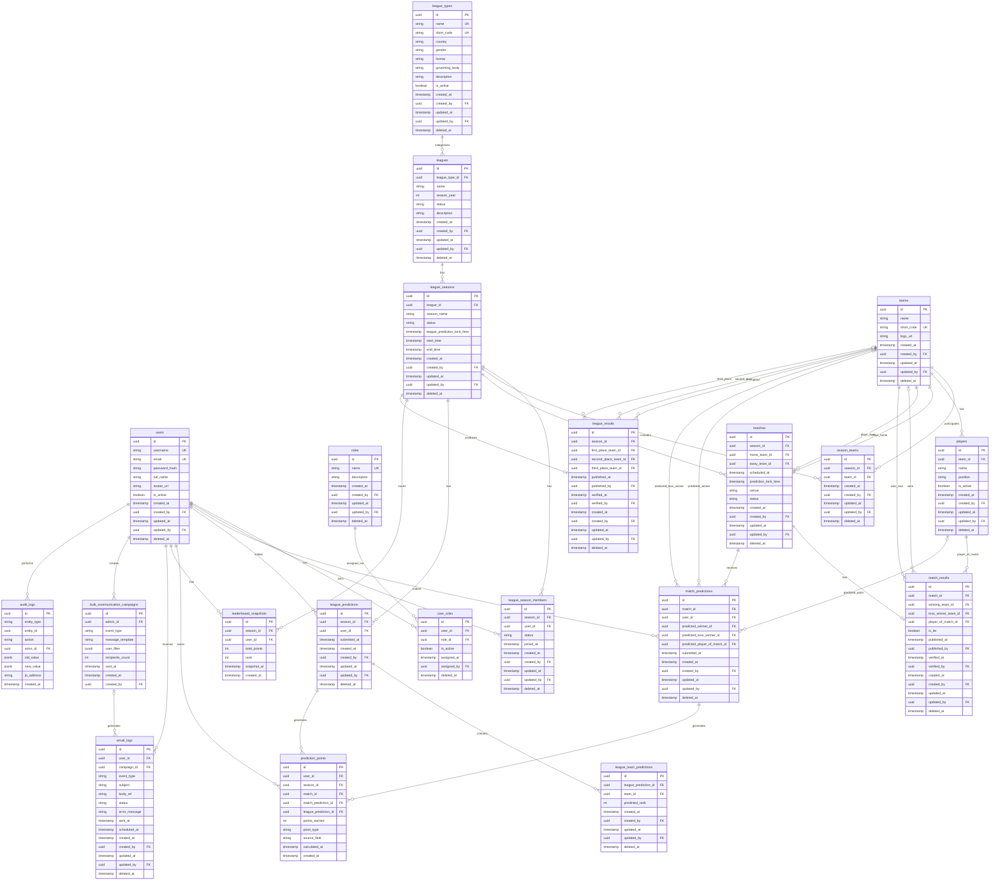

# Family League — Entity Relationship Diagram

---

## Table Summary

| Table | Purpose |
|---|---|
| `users` | All platform users (admin and regular) |
| `roles` | Master role definitions — `ROLE_USER`, `ROLE_ADMIN` |
| `user_roles` | Many-to-many join; an admin holds both roles |
| `league_types` | Tournament master — IPL, WPL, BBL with format/gender/country |
| `leagues` | A specific edition of a league type — e.g. IPL 2025 |
| `league_seasons` | Phase within an edition; holds `league_prediction_lock_time` (4 hrs before first match) |
| `league_season_members` | Users participating in a given season |
| `teams` | Team master, reusable across seasons |
| `players` | Players belonging to a team |
| `season_teams` | Teams registered for a specific season |
| `matches` | Scheduled matches within a season; holds per-match `prediction_lock_time` (1 hr before start) |
| `match_results` | Admin-entered and admin-verified result for a match |
| `league_predictions` | A user's league-level prediction for a season |
| `league_team_predictions` | Full rank ordering (1 to n) within a league prediction |
| `match_predictions` | A user's per-match prediction (winner, toss, POTM) |
| `prediction_points` | Immutable points ledger, calculated server-side only |
| `leaderboard_snapshots` | Ranked snapshot after each result is processed |
| `league_results` | Admin-entered and admin-verified final standings for a season |
| `bulk_communication_campaigns` | Admin-initiated bulk email campaigns with audience filter and message |
| `email_logs` | Every email sent or scheduled; optionally linked to a bulk campaign |
| `audit_logs` | Generic entity-level change log with old/new JSON |
